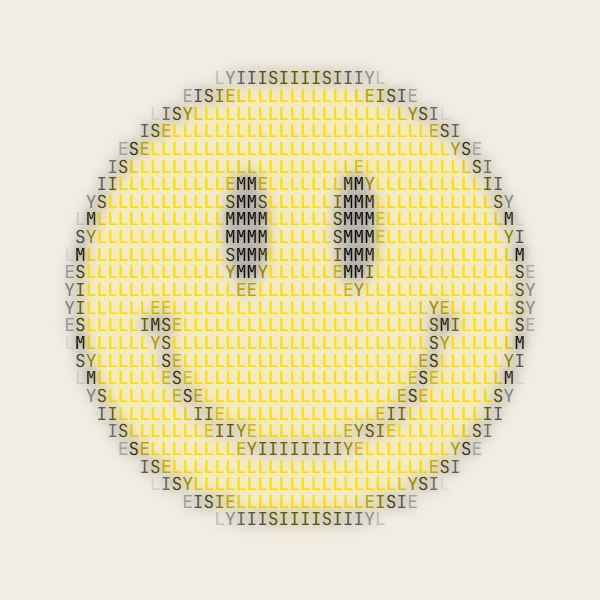
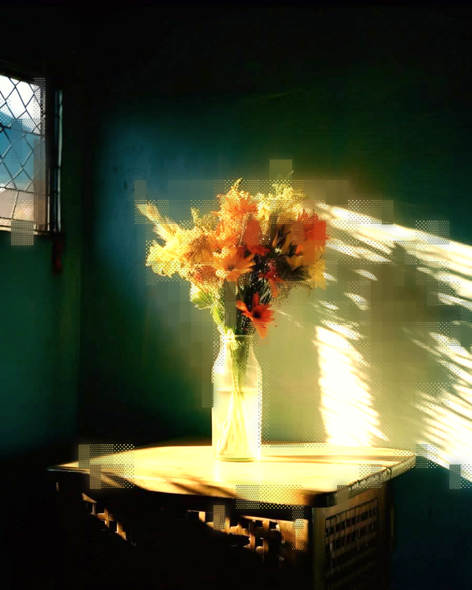
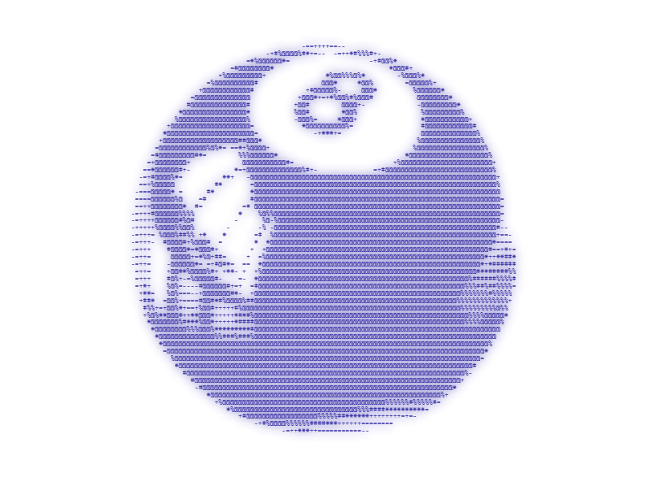
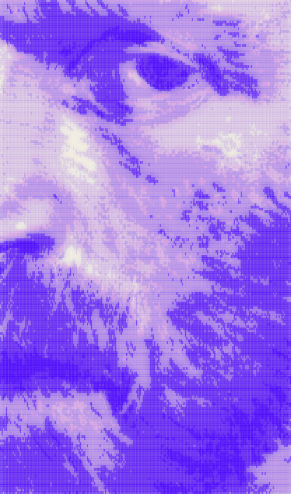
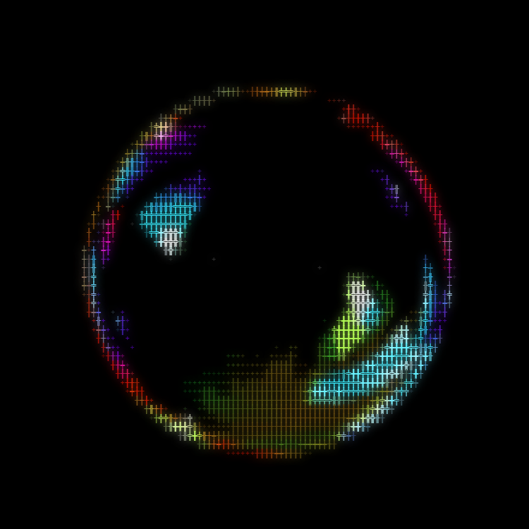
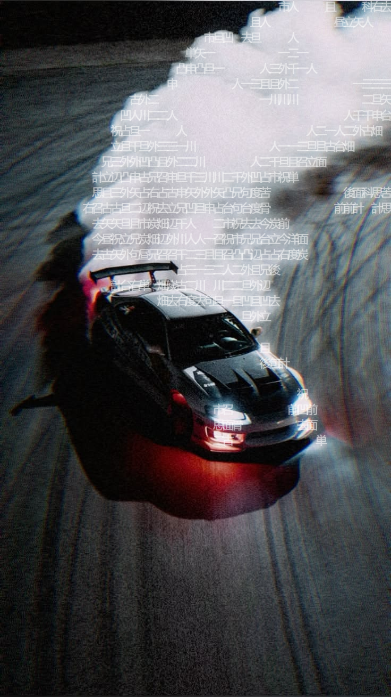
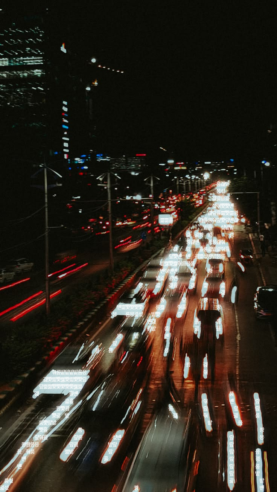

# ARTSCII

ARTSCII is a browser-based image-to-ASCII studio for turning photographs and illustrations into configurable character art. Upload an image, tune the character mapping and visual treatment in real time, then export the result as a PNG, plain-text grid, or self-contained HTML file.

The project is intentionally client-side: images are decoded and processed in the browser and are not uploaded to a server.

## Image Examples
















## Features

- Convert JPEG, PNG, and WebP images directly in the browser.
- Import images by file picker, drag and drop, or pasting an image from the clipboard.
- Adjust output resolution from 20 to 260 columns.
- Choose from built-in character ramps:
	- Extended
	- Classic
	- Minimal
	- Blocky
	- Cross
	- Stars
	- Circles
	- Korean
	- Japanese
- Define a custom character ramp with up to 200 characters. ARTSCII removes duplicate characters and orders custom glyphs by measured visual density.
- Invert the luminance-to-character mapping.
- Use minimum and maximum luminance thresholds to remove unwanted highlights or shadows.
- Choose from JetBrains Mono, Fira Code, IBM Plex Mono, Source Code Pro, and Space Mono.
- Render characters in one custom color or sample their color from the source image.
- Tune character opacity and glow.
- Use a solid background color or the filtered source image as the background layer.
- Apply grayscale, sepia, invert, vintage, cool, or noir filters.
- Adjust exposure, brightness, contrast, saturation, warmth, tint, and blur.
- Export to PNG, TXT, or standalone HTML.
- Keep processing local with no backend or image upload requirement.

## How It Works

ARTSCII reduces the source image to a grid of averaged color cells:

1. The selected image is decoded into an off-screen canvas.
2. Large source images are scaled down to a maximum width of 800 pixels for predictable browser performance.
3. The selected background filter and tonal adjustments are applied before sampling.
4. The image is divided into the requested number of columns and aspect-correct rows.
5. Each cell is averaged into an RGB color and luminance value.
6. Luminance is normalized across the image and mapped to a character ramp.
7. Thresholds can replace cells outside the selected luminance range with spaces.
8. The result is drawn to a canvas with the selected font, colors, opacity, glow, and background treatment.

Character mapping is based on the measured density of the glyphs in the browser font rather than relying only on the order supplied by the user. This makes custom ramps work more consistently across different symbols and writing systems.

## Using the Editor

### 1. Import an image

On the initial screen, use any of these methods:

- Drop a JPEG, PNG, or WebP onto the upload area.
- Click the upload area and choose a file.
- Copy an image to the system clipboard and paste it while the editor is open.

If the file cannot be read or is not one of the supported formats, ARTSCII displays a temporary error message.

### 2. Shape the character grid

The **Characters** section controls how the source image becomes text:

- **Columns** controls horizontal detail. More columns preserve more detail but produce a larger character grid.
- **Minimum luminance** hides cells darker than the selected value.
- **Maximum luminance** hides cells brighter than the selected value.
- **Character ramp** selects the symbols used for the tonal range.
- **Custom...** reveals a text field for a user-defined ramp. Use at least two distinct characters for a custom ramp to take effect.
- **Invert mapping** reverses the ramp so light and dark areas use opposite glyph densities.

### 3. Style the characters

The **Appearance** section controls the foreground layer:

- **Font** changes the monospace typeface and recalculates the character aspect ratio.
- **Character color** can be a single custom color or the sampled source-image color for each cell.
- **Opacity** controls the alpha of the character layer.
- **Glow** adds a soft text shadow around each character.

### 4. Tune the background

The **Background** section controls the surface behind the characters:

- **Fill mode** uses either a solid color or the source image.
- **Fill color** is available when solid mode is selected.
- **Filter** applies a preset visual treatment before the image is sampled and rendered.
- **Exposure** and **Brightness** change overall lightness.
- **Contrast** expands or compresses tonal separation.
- **Saturation** controls color intensity.
- **Warmth** shifts toward sepia or cooler hues.
- **Tint** rotates the hue.
- **Blur** softens the background in pixels.

Background adjustments affect both the luminance mapping and the rendered background, so they can change which characters appear as well as how the final canvas looks.

### 5. Export the result

The **Export** section provides three formats:

- **PNG** downloads the rendered canvas as `ascii-art.png`.
- **TXT** downloads the character grid as `ascii-art.txt`, preserving rows and columns as plain text.
- **HTML** downloads `ascii-art.html`, a standalone page containing the generated character art and its current styling. When the source image is used as a background, the image data is embedded in the file.

Export buttons remain disabled until an image has been converted.

## Development

### Requirements

- Node.js 18 or newer is recommended.
- npm, pnpm, or another Node package manager.
- A modern browser with Canvas, Clipboard, and File API support.

### Install and run locally

```bash
npm install
npm run dev
```

Vite will print the local development URL in the terminal, usually `http://localhost:5173`.

### Available scripts

```bash
npm run dev      # Start the Vite development server
npm run build    # Create a production build in dist/
npm run preview  # Preview the production build locally
npm run lint     # Run oxlint
```

## Project Structure

```text
ARTSCII/
├── index.html             # Vite document entry point
├── package.json            # Scripts and dependencies
├── vite.config.js          # Vite configuration
├── public/                 # Static public assets
├── src/
│   ├── App.jsx             # Editor layout, controls, import, and export actions
│   ├── ascii.js            # Image sampling, ramp mapping, canvas rendering, and serializers
│   ├── index.css           # Global styles and design tokens
│   ├── main.jsx            # React application entry point
│   └── assets/              # Application artwork and branding
└── README.md
```

## Performance Notes

ARTSCII separates expensive grid computation from fast visual redraws. Changes that affect the character mapping, such as column count, thresholds, ramps, filters, or tonal adjustments, recompute the grid. Changes such as character color, opacity, glow, and font styling redraw the existing grid when possible.

The source canvas is capped at 800 pixels wide before processing. This keeps sampling work bounded while retaining enough detail for the editor and PNG output. Increasing the column count increases the number of cells and therefore the amount of work required for recomputation.

## Browser and File Notes

- Input validation accepts `image/jpeg`, `image/png`, and `image/webp`.
- The browser must allow canvas image decoding and rendering.
- Clipboard import depends on the browser exposing image data through the paste event.
- Exported TXT files contain the character grid only; styling is intentionally omitted.
- Exported HTML files are generated from the current settings and do not require the ARTSCII application to open.
- Very large or unusually complex custom ramps may render differently depending on the selected font and browser font availability.

## Customization

To add or change a built-in ramp, update `PRESETS` in `src/ascii.js`. Each preset supplies a label and an ordered array of characters. For broader UI changes, controls and default values live in `src/App.jsx`, while shared visual tokens and global rules live in `src/index.css`.

When adding a new setting, check whether it belongs in the recompute path or the redraw-only path. Settings that change luminance sampling or character selection must trigger recomputation; purely visual settings can usually redraw the existing computed grid.

## Troubleshooting

### The image does not load

Confirm that the file is a JPEG, PNG, or WebP and that the browser can read it. Try choosing the file through the picker instead of dragging it, or reload the page and paste the image again.

### The output looks stretched

The editor accounts for the selected font's measured character width when calculating rows. If a font is unavailable locally, the browser may substitute another monospace font. Install the intended font or choose another available font from the Appearance section.

### The output is too sparse or too dense

Adjust the Columns slider, then refine the Minimum and Maximum luminance values. A different ramp can also change the apparent density without changing the source image.

### The custom ramp has no visible effect

Use at least two distinct, non-newline characters. Duplicate characters are removed automatically, and a ramp with fewer than two unique characters falls back to the Classic ramp.

## License

No license has been declared in `package.json` or this repository yet. Add the project's chosen license here when one is selected.
